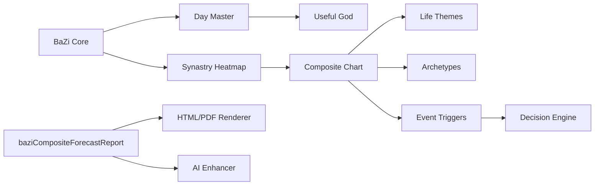

# Genesis Soul Cathedral System Documentation

## Complete Architecture Reference

**Version:** 1.0.0
**Date:** January 2026
**Status:** Production Ready

---

## Table of Contents

1. [Overview](#overview)
2. [Cathedral Index System](#cathedral-index-system)
3. [Schema Map Architecture](#schema-map-architecture)
4. [AI Narrative Enhancer](#ai-narrative-enhancer)
5. [Module Registry](#module-registry)
6. [Data Flow](#data-flow)
7. [Timing Flow](#timing-flow)
8. [Narrative Flow](#narrative-flow)
9. [API Reference](#api-reference)
10. [Usage Examples](#usage-examples)

---

## Overview

The Genesis Soul Cathedral is a comprehensive BaZi (Four Pillars of Destiny) relationship analysis platform. It transforms traditional Chinese metaphysics into a modern, structured system with:

- **24+ calculation engines** for natal charts, synastry, composites, and timing
- **7 cathedral wings** organizing all modules by domain
- **10-chapter forecast reports** with AI-powered narrative enhancement
- **Complete architectural mapping** for documentation and AI navigation

### Key Features

```
┌─────────────────────────────────────────────────────────────────────────────┐
│                    CATHEDRAL ARCHITECTURE                                    │
├─────────────────────────────────────────────────────────────────────────────┤
│                                                                             │
│   Wing I: Core Identity (核心身份)                                          │
│   └── BaZi Core, Day Master, Ten Gods, Useful God, Shen Sha                │
│                                                                             │
│   Wing II: Relationship (关系)                                              │
│   └── Synastry Heatmap, Composite Chart, Archetypes, Life Themes           │
│                                                                             │
│   Wing III: Timing (时机)                                                   │
│   └── Luck Pillars, Annual, Monthly, Event Triggers, Trajectory            │
│                                                                             │
│   Wing IV: Family & System (家庭与系统)                                     │
│   └── Multi-Relationship Mapping, Constellation                            │
│                                                                             │
│   Wing V: Decision (决策)                                                   │
│   └── Relationship Decision Engine, Guidance                               │
│                                                                             │
│   Wing VI: Reports (报告)                                                   │
│   └── Forecast Report Generator, HTML/PDF Renderer, AI Enhancer            │
│                                                                             │
│   Wing VII: Archive (档案)                                                  │
│   └── Cathedral Index, Schema Map, Narrative Generator                     │
│                                                                             │
└─────────────────────────────────────────────────────────────────────────────┘
```

---

## Cathedral Index System

The Cathedral Index provides navigation and documentation for all modules.

### Files

| File | Purpose |
|------|---------|
| `src/cathedral/indexTypes.ts` | Type definitions for wings, sections, items |
| `src/cathedral/indexData.ts` | Complete module mapping and index builders |
| `src/cathedral/narrativeGenerator.ts` | Ceremonial prose generation |
| `src/cathedral/CathedralIndexPage.tsx` | React UI component |
| `src/cathedral/CathedralRoutes.tsx` | Multi-page navigation |
| `src/cathedral/cathedralSchemaMap.ts` | Architectural blueprint |
| `src/cathedral/index.ts` | Barrel exports |

### Type Hierarchy

```typescript
CathedralIndex
├── subject: CathedralSubject
│   ├── id: string
│   ├── type: 'individual' | 'couple' | 'family' | 'system'
│   ├── label: string
│   ├── partnerA?: { name, birthDate }
│   └── partnerB?: { name, birthDate }
├── wings: CathedralWing[]
│   ├── id: WingId
│   ├── label: string
│   ├── labelChinese: string
│   └── sections: CathedralSection[]
│       ├── id: string
│       ├── label: string
│       └── items: CathedralItem[]
│           ├── id: string
│           ├── status: ModuleStatus
│           ├── type: ModuleType
│           ├── sourceFile?: string
│           └── exports?: string[]
└── metadata: CathedralMetadata
    ├── version: string
    ├── generatedAt: Date
    └── totalModules: number
```

### Building an Index

```typescript
import { buildCoupleIndex, buildIndividualIndex } from '@/cathedral';

// For a couple
const coupleIndex = buildCoupleIndex(
  'reagan-couple',
  'Ronald Reagan', '1911-02-06',
  'Nancy Reagan', '1921-07-06'
);

// For an individual
const individualIndex = buildIndividualIndex(
  'ronald-reagan',
  'Ronald Reagan',
  '1911-02-06'
);
```

### Generating Narratives

```typescript
import {
  generateCeremonialNarrative,
  generateRelationshipDedication,
  generateProgressReport
} from '@/cathedral';

// Full ceremonial prose
const narrative = generateCeremonialNarrative(index);

// Couple dedication
const dedication = generateRelationshipDedication(
  'Ronald', 'Nancy', index
);

// Progress report
const progress = generateProgressReport(index);
```

---

## Schema Map Architecture

The Schema Map provides a complete architectural blueprint of the system.

### Structure

```typescript
CathedralSchemaMap
├── version: string
├── generatedAt: Date
├── modules: ModuleDefinition[]      // 24 modules
├── types: TypeDefinition[]          // Core types
├── dataFlow: DataFlowEdge[]         // Data movement
├── timingFlow: TimingFlowNode[]     // Temporal cascade
├── narrativeFlow: NarrativeFlowNode[] // Narrative generation
└── statistics: SchemaStatistics
```

### Module Definition

```typescript
interface ModuleDefinition {
  id: string;                    // e.g., 'baziCompositeChart'
  name: string;                  // e.g., 'Composite Chart Engine'
  nameChinese: string;           // e.g., '合盘命盘引擎'
  category: ModuleCategory;      // 'engine' | 'service' | 'report' | etc.
  status: ModuleImplementationStatus;
  path: string;                  // Source file path
  description: string;
  dependencies: string[];        // Module IDs
  dependents: string[];          // Who depends on this
  exports: string[];             // Exported functions
  inputs: TypeReference[];       // Input types
  outputs: TypeReference[];      // Output types
  tags: string[];
}
```

### Query Utilities

```typescript
import {
  getModuleById,
  getModulesByCategory,
  getModuleDependenciesDeep,
  getDataFlowForModule,
  generateDataFlowMermaid
} from '@/cathedral';

// Get a specific module
const composite = getModuleById('baziCompositeChart');

// Get all engines
const engines = getModulesByCategory('engine');

// Get full dependency tree
const deps = getModuleDependenciesDeep('baziCompositeForecastReport');
// Returns: ['baziCompositeChart', 'baziSynastryHeatmap', 'baziCore', ...]

// Get data flow for a module
const flow = getDataFlowForModule('baziCompositeChart');
// { inputs: [...], outputs: [...] }

// Generate Mermaid diagram
const mermaid = generateDataFlowMermaid();
```

---

## AI Narrative Enhancer

LLM-powered narrative expansion for forecast reports.

### File

`src/utils/compositeNarrativeEnhancer.ts`

### Tone Options

| Tone | Style | Example |
|------|-------|---------|
| `gentle` | Warm, nurturing, supportive | "The gentle dance of your charts reveals a beautiful truth..." |
| `neutral` | Clear, balanced, informative | "The composite analysis indicates several key patterns..." |
| `technical` | Precise, scholarly, detailed | "The Day Master (日主) configuration presents a Wood-dominant structure..." |
| `poetic` | Lyrical, evocative, metaphorical | "Two rivers meeting at twilight, your destinies intertwine..." |

### Depth Options

| Depth | Level | Assumptions |
|-------|-------|-------------|
| `beginner` | Introductory | No prior BaZi knowledge, explain all concepts |
| `intermediate` | Moderate | Basic BaZi familiarity (elements, pillars, Ten Gods) |
| `expert` | Advanced | Professional practitioner level, classical terminology |

### Usage

```typescript
import {
  enhanceReport,
  enhanceChapter,
  extractChaptersForEnhancement,
  buildEnhancementContext,
  getDefaultEnhancementOptions
} from '@/utils/compositeNarrativeEnhancer';

// Enhancement options
const options = {
  tone: 'poetic',
  depth: 'intermediate',
  includeMetaphors: true,
  includeAdvice: true,
  maxTokensPerChapter: 2000,
  language: 'en'
};

// Provide your LLM
const llm = {
  generateCompletion: async (prompt, systemPrompt, maxTokens) => {
    // Call your LLM API
    return await yourLLM.complete(prompt, systemPrompt, maxTokens);
  }
};

// Enhance full report
const enhanced = await enhanceReport(
  originalReport,
  options,
  llm,
  (chapter, total) => console.log(`Processing ${chapter}/${total}`)
);

// Or enhance single chapter
const chapters = extractChaptersForEnhancement(report);
const context = buildEnhancementContext(report);
const enhancedChapter = await enhanceChapter(
  chapters[0], context, options, llm
);
```

### Chapter-Specific Prompts

Each of the 10 chapters has custom prompts:

| Chapter | Focus | Emotional Arc |
|---------|-------|---------------|
| 1 | Relationship Essence | Grounding, identity |
| 2 | Synastry Overview | Connection, recognition |
| 3 | Composite Chart | Revelation, structure |
| 4 | Relationship Archetype | Inspiration, mythic |
| 5 | Life Themes | Depth, meaning |
| 6 | Lifecycle Phase | Orientation, hope |
| 7 | Timing Forecast | Anticipation, strategy |
| 8 | Event Triggers | Alert, readiness |
| 9 | Trajectory Curves | Perspective, vision |
| 10 | Guidance | Integration, empowerment |

---

## Module Registry

### Complete Module List

#### Core Engines

| Module | Chinese | Status | Dependencies |
|--------|---------|--------|--------------|
| `baziCore` | 八字核心引擎 | Complete | - |
| `baziDayMaster` | 日主分析 | Complete | baziCore |
| `baziTenGods` | 十神引擎 | Complete | baziCore, baziDayMaster |
| `baziUsefulGod` | 用神引擎 | Complete | baziCore, baziDayMaster, baziTenGods |
| `baziShenSha` | 神煞引擎 | Complete | baziCore |
| `baziConflicts` | 冲害刑破引擎 | Complete | baziCore |
| `baziCombinations` | 合会引擎 | Complete | baziCore |

#### Synastry & Composite

| Module | Chinese | Status | Dependencies |
|--------|---------|--------|--------------|
| `baziSynastryHeatmap` | 合盘热力图引擎 | Complete | baziCore, baziConflicts, baziCombinations |
| `baziCompositeChart` | 合盘命盘引擎 | Complete | baziCore, baziDayMaster, baziTenGods, baziUsefulGod, baziShenSha |

#### Relationship Analysis

| Module | Chinese | Status | Dependencies |
|--------|---------|--------|--------------|
| `baziLifeThemes` | 人生主题引擎 | Complete | baziCompositeChart, baziTenGods |
| `baziRelationshipArchetypes` | 关系原型引擎 | Complete | baziCompositeChart, baziLifeThemes |
| `baziRelationshipLifecycle` | 关系生命周期模型 | Complete | baziCompositeChart |
| `baziMultiRelationshipMapping` | 多关系映射引擎 | Complete | baziCompositeChart, baziSynastryHeatmap |

#### Timing Modules

| Module | Chinese | Status | Dependencies |
|--------|---------|--------|--------------|
| `baziLuckPillarFavorability` | 大运喜忌引擎 | Complete | baziCore, baziUsefulGod |
| `baziAnnualLuckFavorability` | 流年喜忌引擎 | Complete | baziCore, baziUsefulGod, baziLuckPillarFavorability |
| `baziMonthlyLuckFavorability` | 流月喜忌引擎 | Complete | baziCore, baziUsefulGod, baziAnnualLuckFavorability |
| `baziCompositeEventTrigger` | 合盘应期引擎 | Complete | baziCompositeChart, timing modules |
| `baziTrajectory` | 运势曲线引擎 | Complete | baziCompositeChart, baziLuckPillarFavorability |

#### Decision & Reports

| Module | Chinese | Status | Dependencies |
|--------|---------|--------|--------------|
| `baziRelationshipDecisionEngine` | 关系决策引擎 | Complete | baziCompositeChart, events, lifecycle, trajectory |
| `baziCompositeForecastReport` | 合盘预测报告生成器 | Complete | All analysis engines |
| `compositeReportRenderer` | 合盘报告渲染器 | Complete | baziCompositeForecastReport |
| `compositeNarrativeEnhancer` | 叙事增强器 | Complete | baziCompositeForecastReport |

#### Cathedral System

| Module | Chinese | Status | Dependencies |
|--------|---------|--------|--------------|
| `cathedralIndexTypes` | 大教堂索引类型 | Complete | - |
| `cathedralIndexData` | 大教堂索引数据 | Complete | cathedralIndexTypes |
| `cathedralNarrativeGenerator` | 大教堂叙事生成器 | Complete | cathedralIndexTypes, cathedralIndexData |
| `cathedralSchemaMap` | 大教堂架构图 | Complete | - |

---

## Data Flow



---

## Timing Flow

The system processes timing in layers, from static to dynamic:

```
Layer 1: Natal (静态)
└── Birth chart calculation - the foundation

Layer 2: Composite (合盘)
└── Relationship entity chart - the merged identity

Layer 3: Luck Pillar (大运)
└── 10-year cycles - major life phases

Layer 4: Annual (流年)
└── Yearly cycles - year-by-year fortune

Layer 5: Monthly (流月)
└── Monthly cycles - fine timing

Layer 6: Event (应期)
└── Event triggers - specific manifestation windows
```

---

## Narrative Flow

The 10-chapter forecast report follows this narrative arc:

```
Chapter 1: Relationship Essence
└── Emotional Arc: Grounding, establishing identity

Chapter 2: Synastry Overview
└── Emotional Arc: Connection, recognition

Chapter 3: Composite Chart Interpretation
└── Emotional Arc: Revelation, understanding structure

Chapter 4: Relationship Archetype
└── Emotional Arc: Inspiration, mythic resonance

Chapter 5: Life Themes
└── Emotional Arc: Depth, meaning-making

Chapter 6: Relationship Lifecycle Phase
└── Emotional Arc: Orientation, hope

Chapter 7: Composite Timing Forecast
└── Emotional Arc: Anticipation, strategic awareness

Chapter 8: Event Trigger Windows
└── Emotional Arc: Alert, readiness

Chapter 9: Destiny Trajectory Curves
└── Emotional Arc: Perspective, long-term vision

Chapter 10: Guidance & Integration
└── Emotional Arc: Integration, empowerment
```

---

## API Reference

### Cathedral Index

```typescript
// Build indices
buildCathedralIndex(subject: CathedralSubject): CathedralIndex
buildCoupleIndex(id, partnerAName, partnerABirthDate, partnerBName, partnerBBirthDate): CathedralIndex
buildIndividualIndex(id, name, birthDate): CathedralIndex
buildFamilyIndex(id, familyName, members): CathedralIndex

// Query
getCathedralItem(index, wingId, sectionId, itemId): CathedralItem | null
getBreadcrumbs(index, wingId, sectionId?, itemId?): Breadcrumb[]
filterCathedralItems(wings, options): CathedralItem[]
computeCathedralStats(wings): CathedralStats

// Narratives
generateCeremonialNarrative(index): string
generateWingNarrative(wing): string
generateRelationshipDedication(partnerAName, partnerBName, index): string
generateProgressReport(index): string
generateModuleCard(item, wing, section): string
exportCathedralAsMarkdown(index): string
```

### Schema Map

```typescript
// Build
buildSchemaMap(): CathedralSchemaMap

// Query Modules
getModuleById(id: string): ModuleDefinition | undefined
getModulesByCategory(category: ModuleCategory): ModuleDefinition[]
getModulesByStatus(status: ModuleImplementationStatus): ModuleDefinition[]
getModuleDependenciesDeep(moduleId: string): string[]
getModuleDependents(moduleId: string): string[]

// Query Types
getTypeByName(name: string): TypeDefinition | undefined
getTypesUsedByModule(moduleId: string): TypeDefinition[]

// Query Flows
getDataFlowForModule(moduleId: string): { inputs, outputs }
getTimingFlowByLayer(layer: TimingLayer): TimingFlowNode[]
getNarrativeFlowByChapter(chapterNumber: number): NarrativeFlowNode | undefined

// Visualization
generateDataFlowMermaid(): string
generateTimingFlowMermaid(): string
generateDependencyTree(rootModuleId: string): string

// Export
exportSchemaMapAsJSON(): string
exportSchemaMapAsMarkdown(): string
```

### AI Narrative Enhancer

```typescript
// Extract & Context
extractChaptersForEnhancement(report: CompositeForecastReport): ChapterText[]
buildEnhancementContext(report: CompositeForecastReport): EnhancementContext

// Enhancement
enhanceChapter(chapter, context, options, llm): Promise<EnhancedChapter>
enhanceReport(report, options, llm, onProgress?): Promise<EnhancedReport>
streamEnhanceChapter(chapter, context, options, llm, onChunk): Promise<EnhancedChapter>

// Prompts
buildChapterSystemPrompt(chapterNumber, options, context): string
buildChapterUserPrompt(chapter: ChapterText): string

// Utilities
getDefaultEnhancementOptions(): NarrativeEnhanceOptions
validateEnhancementOptions(options): NarrativeEnhanceOptions
getTonePreview(tone: NarrativeTone): string
getDepthDescription(depth: NarrativeDepth): string
getEnhancementStats(report: EnhancedReport): EnhancementStats

// Export
exportEnhancedReportAsMarkdown(report: EnhancedReport): string
exportEnhancedReportAsJSON(report: EnhancedReport): string
```

---

## Usage Examples

### Generate Full Report Pipeline

```typescript
import { calculateBaZi } from '@/utils/baziCore';
import { calculateSynastryHeatmap } from '@/utils/baziSynastryHeatmap';
import { calculateCompositeChart } from '@/utils/baziCompositeChart';
import { generateCompositeForecastReport } from '@/utils/baziCompositeForecastReport';
import { renderCompositeReportHtml } from '@/utils/compositeReportRenderer';
import { enhanceReport } from '@/utils/compositeNarrativeEnhancer';

// 1. Calculate natal charts
const chartA = calculateBaZi(new Date('1911-02-06'));
const chartB = calculateBaZi(new Date('1921-07-06'));

// 2. Calculate synastry
const synastry = calculateSynastryHeatmap(chartA, chartB);

// 3. Calculate composite
const composite = calculateCompositeChart(chartA, chartB);

// 4. Generate report
const report = generateCompositeForecastReport({
  partnerA: { name: 'Ronald Reagan', birthDate: '1911-02-06', ... },
  partnerB: { name: 'Nancy Reagan', birthDate: '1921-07-06', ... },
  composite,
  synastry,
  // ... other inputs
});

// 5. Render HTML
const { html, css } = renderCompositeReportHtml({
  reportMarkdown: report.fullNarrative,
  charts: { synastryHeatmap: synastryChartSvg },
  meta: { title: report.title, ... }
});

// 6. Enhance with AI (optional)
const enhanced = await enhanceReport(report, {
  tone: 'poetic',
  depth: 'intermediate'
}, llmProvider);
```

### Query Schema for Documentation

```typescript
import {
  buildSchemaMap,
  getModulesByCategory,
  exportSchemaMapAsMarkdown
} from '@/cathedral';

// Build the complete map
const map = buildSchemaMap();

console.log(`Total modules: ${map.statistics.totalModules}`);
console.log(`Engines: ${map.statistics.byCategory.engine}`);
console.log(`Complete: ${map.statistics.byStatus.complete}`);

// Get all timing modules
const timingEngines = getModulesByCategory('engine')
  .filter(m => m.tags.includes('timing'));

// Export as documentation
const markdown = exportSchemaMapAsMarkdown();
fs.writeFileSync('ARCHITECTURE.md', markdown);
```

---

## File Structure

```
src/
├── cathedral/
│   ├── index.ts                    # Barrel exports
│   ├── indexTypes.ts               # Type definitions
│   ├── indexData.ts                # Module mapping
│   ├── narrativeGenerator.ts       # Ceremonial prose
│   ├── cathedralSchemaMap.ts       # Architecture blueprint
│   ├── CathedralIndexPage.tsx      # React UI
│   ├── CathedralRoutes.tsx         # Navigation
│   └── cathedralIndex.schema.json  # JSON Schema
├── utils/
│   ├── baziCore.ts                 # Core engine
│   ├── baziCompositeChart.ts       # Composite engine
│   ├── baziCompositeForecastReport.ts  # Report generator
│   ├── compositeReportRenderer.ts  # HTML/PDF renderer
│   └── compositeNarrativeEnhancer.ts   # AI enhancer
└── ...
```

---

## Version History

| Version | Date | Changes |
|---------|------|---------|
| 1.0.0 | Jan 2026 | Initial release with full cathedral system |

---

*Generated by Genesis Soul Cathedral System*
