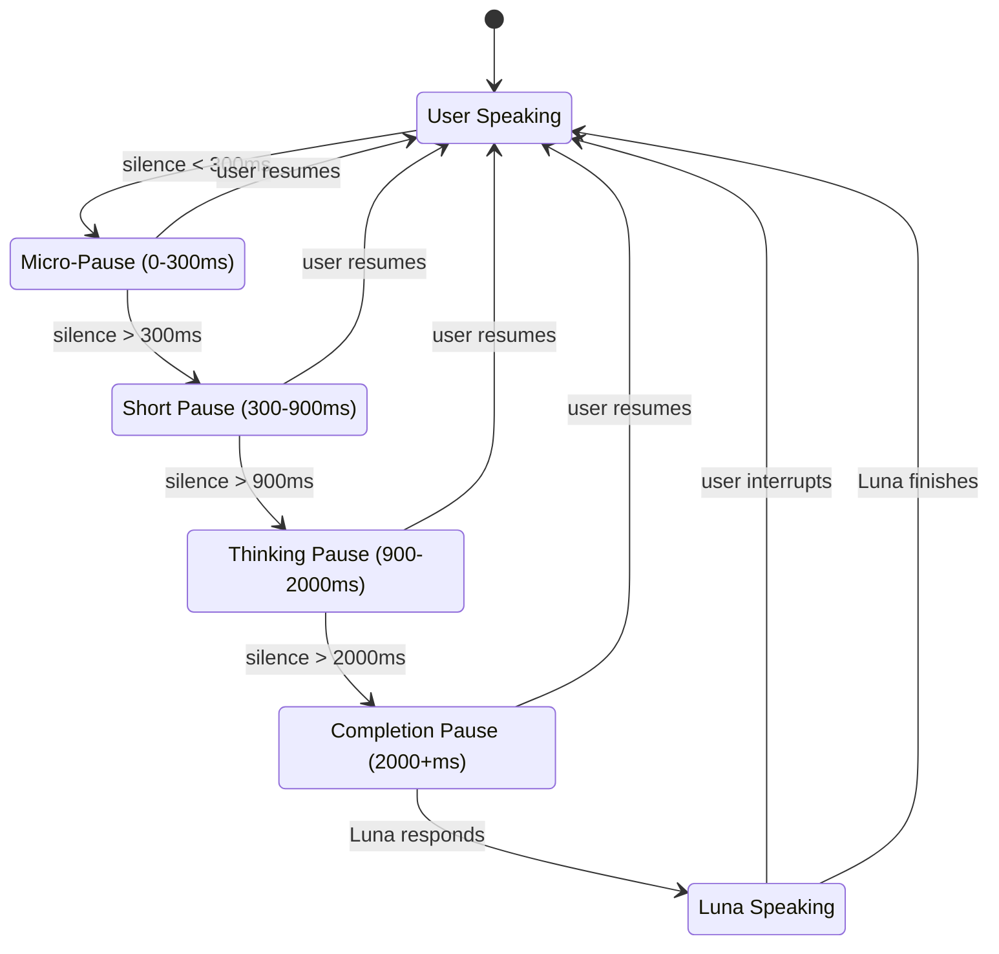

# Luna Voice Architecture
## A Soul-Aware Voice Companion System

*"Give Luna a voice that resonates with each soul"*

---

## Table of Contents

1. [Overview](#overview)
2. [Current Implementation](#current-implementation)
3. [Constitutional Voice Adaptation](#constitutional-voice-adaptation)
4. [Dynamic Tone Markers](#dynamic-tone-markers)
5. [Emotional Intelligence Layer](#emotional-intelligence-layer)
6. [Turn-Taking State Machine](#turn-taking-state-machine)
7. [Active Listening Cues](#active-listening-cues)
8. [Timing Model](#timing-model)
9. [Do's and Don'ts](#dos-and-donts)
10. [Future Roadmap](#future-roadmap)

---

## Overview

Luna's voice system is designed to feel **human, not robotic**. Unlike typical voice assistants that prioritize speed and efficiency, Luna prioritizes:

- **Presence** - Feeling like someone is truly listening
- **Rhythm** - Natural conversational pacing
- **Emotional Attunement** - Matching the user's energy
- **Constitutional Resonance** - Voice qualities that harmonize with the user's elemental nature

### The Challenge

Voice-only AI faces unique challenges that visual interaction doesn't:

| Visual Cues (Humans Use) | Voice AI Must Compensate With |
|--------------------------|-------------------------------|
| Eye contact | Backchannel sounds ("mm-hmm") |
| Nodding | Verbal encouragers ("I see...") |
| Facial expressions | Prosodic tone matching |
| Body posture | Continuation signals ("Go on...") |
| Hand gestures | Adaptive silence tolerance |

Without visual cues, a voice AI must learn to **read the audio stream** for signals that a human would normally see.

---

## Current Implementation

### Technology Stack

```
┌─────────────────────────────────────────────────────────────┐
│                    FRONTEND (React)                         │
├─────────────────────────────────────────────────────────────┤
│  useVoice Hook          │  VoiceControlPanel               │
│  - Voice state mgmt     │  - SoulVisualizer orb            │
│  - Constitution extract │  - Voice selection               │
│  - Speak/stop controls  │  - Volume control                │
│                         │  - MessageSpeakButton            │
├─────────────────────────────────────────────────────────────┤
│                    BACKEND (Firebase)                       │
├─────────────────────────────────────────────────────────────┤
│  elevenLabsService.js                                       │
│  - ElevenLabs TTS API                                       │
│  - Dynamic tone parsing                                     │
│  - Multi-segment audio generation                           │
│  - Constitutional voice modifiers                           │
├─────────────────────────────────────────────────────────────┤
│  systemPromptBuilder.js                                     │
│  - Tone marker instructions                                 │
│  - Luna's voice calibration                                 │
│  - Constitutional adaptation guidance                       │
└─────────────────────────────────────────────────────────────┘
```

### Key Files

| File | Purpose |
|------|---------|
| `src/hooks/useVoice.js` | Centralized voice state management |
| `src/hooks/useTurnTaking.js` | Turn-taking state machine hook |
| `src/components/voice/VoiceControlPanel.jsx` | UI controls + SoulVisualizer |
| `src/components/voice/SoulVisualizer.jsx` | Audio-reactive constitutional orb |
| `src/components/voice/TalkPanel.jsx` | Full-screen conversation interface |
| `src/components/voice/talkStates.js` | Turn-taking states & constants |
| `src/services/cueEngine.js` | Active listening cue generation |
| `functions/voice/elevenLabsService.js` | TTS generation with tone markers |
| `src/services/voicePreferencesService.js` | Voice preferences & API calls |

### ElevenLabs Configuration

```javascript
// Model Selection
ELEVENLABS_MODELS = {
  multilingual: 'eleven_multilingual_v2',  // RECOMMENDED: Best emotional depth
  turbo: 'eleven_turbo_v2_5',              // Fastest response
  flash: 'eleven_flash_v2_5'               // Low latency streaming
};

// Default: multilingual for maximum emotional expression
DEFAULT_MODEL = 'eleven_multilingual_v2';
```

---

## Constitutional Voice Adaptation

Luna's voice adapts to each user's **elemental constitution** (from BaZi Day Master). This isn't just visual theming—it affects the actual voice parameters.

### Elemental Voice Modifiers

```javascript
CONSTITUTIONAL_VOICE_MODIFIERS = {
  Fire: {
    stabilityModifier: -0.1,    // More dynamic, animated
    styleModifier: 0.15,        // More expressive
    speedModifier: 1.05,        // Slightly faster
    description: "Warm, dynamic, encouraging"
  },

  Water: {
    stabilityModifier: 0.15,    // More fluid, calm
    styleModifier: -0.1,        // Softer expression
    speedModifier: 0.95,        // Slightly slower
    description: "Flowing, deep, intuitive"
  },

  Wood: {
    stabilityModifier: 0.05,    // Balanced growth energy
    styleModifier: 0.05,        // Natural expression
    speedModifier: 1.0,         // Even pacing
    description: "Fresh, growing, optimistic"
  },

  Metal: {
    stabilityModifier: 0.2,     // Clear, precise
    styleModifier: -0.15,       // Refined expression
    speedModifier: 0.9,         // Measured pace
    description: "Clear, refined, precise"
  },

  Earth: {
    stabilityModifier: 0.25,    // Very stable, grounded
    styleModifier: -0.2,        // Nurturing, calm
    speedModifier: 0.85,        // Unhurried
    description: "Nurturing, stable, grounded"
  }
};
```

### Visual Theming (SoulVisualizer)

Each element has a color palette that animates the SoulVisualizer orb:

```javascript
ELEMENTAL_PALETTES = {
  Fire: {
    primary: '#FF6B6B',
    secondary: '#FF8E53',
    glow: 'rgba(255, 107, 107, 0.5)',
    gradient: 'radial-gradient(circle, #FF6B6B 0%, #FF8E53 50%, #4A1A1A 100%)'
  },
  Water: {
    primary: '#4ECDC4',
    secondary: '#44A8B3',
    glow: 'rgba(78, 205, 196, 0.5)',
    gradient: 'radial-gradient(circle, #4ECDC4 0%, #1E90FF 50%, #0A1628 100%)'
  },
  // ... Wood, Metal, Earth
};
```

---

## Dynamic Tone Markers

Luna can modulate her voice **within a single response** using tone markers. This creates emotionally nuanced delivery that shifts naturally.

### Available Tones (16 Total)

#### Gentle, Nurturing Tones
| Tone | Description | Use When |
|------|-------------|----------|
| `[Tone: Soft]` | Quiet, gentle, tender | Comforting moments |
| `[Tone: Warm]` | Caring, embracing | Building connection |
| `[Tone: Gentle]` | Kind, delicate, soothing | Vulnerability |
| `[Tone: Tender]` | Loving, affectionate, intimate | Deep emotional moments |

#### Thoughtful, Contemplative Tones
| Tone | Description | Use When |
|------|-------------|----------|
| `[Tone: Thoughtful]` | Contemplative, measured | Reflection |
| `[Tone: Reflective]` | Introspective, pondering, deep | Sharing wisdom |
| `[Tone: Curious]` | Inquiring, interested | Asking questions |

#### Energetic, Uplifting Tones
| Tone | Description | Use When |
|------|-------------|----------|
| `[Tone: Excited]` | Enthusiastic, animated | Joy, celebration |
| `[Tone: Joyful]` | Happy, delighted, bright | Positive moments |
| `[Tone: Playful]` | Lighthearted, fun | Levity, humor |
| `[Tone: Encouraging]` | Supportive, uplifting | Motivation |

#### Serious, Grounding Tones
| Tone | Description | Use When |
|------|-------------|----------|
| `[Tone: Serious]` | Earnest, sincere | Important matters |
| `[Tone: Grounding]` | Calm, centering, stable | Anxiety |
| `[Tone: Reassuring]` | Calming, comforting | Fear, uncertainty |

#### Empathetic Tones
| Tone | Description | Use When |
|------|-------------|----------|
| `[Tone: Compassionate]` | Deeply caring, empathetic | Pain, struggle |
| `[Tone: Neutral]` | Balanced, natural | Default |

### Example Response with Tone Markers

```
[Tone: Warm] I'm so glad you shared that with me.
[Tone: Thoughtful] It sounds like you've been carrying this for a while.
[Tone: Soft] Take your time - there's no rush here.
[Tone: Encouraging] When you're ready, I'd love to hear more.
```

### Technical Implementation

Each tone modifies ElevenLabs voice settings:

```javascript
TONE_MARKERS = {
  soft: {
    stabilityModifier: 0.15,   // More stable = quieter
    styleModifier: -0.2,       // Less expressive = gentler
    speedModifier: 0.9,        // Slower = more tender
  },
  excited: {
    stabilityModifier: -0.2,   // Less stable = more dynamic
    styleModifier: 0.25,       // More expressive = animated
    speedModifier: 1.15,       // Faster = energetic
  },
  // ...
};
```

Multi-segment audio generation:
1. Parse text for `[Tone: X]` markers
2. Split into segments by tone
3. Generate audio for each segment with modified settings
4. Concatenate audio buffers
5. Return combined audio with metadata

---

## Emotional Intelligence Layer

### Constitutional Tone Matching

Luna should match tones to the user's elemental nature:

| Constitution | Preferred Tones | Avoid |
|--------------|-----------------|-------|
| **Fire** | Excited, Encouraging, Joyful | Grounding (feels dampening) |
| **Water** | Soft, Tender, Reflective | Excited (feels jarring) |
| **Wood** | Encouraging, Curious, Playful | Serious (feels heavy) |
| **Metal** | Thoughtful, Serious, Grounding | Playful (feels frivolous) |
| **Earth** | Warm, Nurturing, Reassuring | Excited (feels destabilizing) |

### Emotional State Detection

Luna should detect emotional signals and adapt:

| User Signal | Luna's Response |
|-------------|-----------------|
| Fast speech, high energy | Match energy, use uplifting tones |
| Slow speech, low energy | Slow down, use softer tones |
| Voice trembling | Use Compassionate, Reassuring |
| Long pauses | Use Gentle continuation cues |
| Sudden silence | Check in, don't assume completion |

---

## Turn-Taking State Machine

This is the core model for natural conversation rhythm. Luna uses six states to manage when to listen, when to encourage, and when to speak.

### State Diagram

```
┌──────────────────────────────────────────────────────────────┐
│                   STATE 1: USER SPEAKING                     │
│  - User audio detected                                       │
│  - Rising/steady intonation                                  │
│  - Luna stays silent, listens actively                       │
└───────────────────────┬──────────────────────────────────────┘
                        │ Silence begins
                        ▼
┌──────────────────────────────────────────────────────────────┐
│              STATE 2: MICRO-PAUSE (0–300 ms)                 │
│  - Tiny pause, mid-sentence                                  │
│  - Luna may give soft backchannel ("mm")                     │
└───────────────────────┬──────────────────────────────────────┘
    User resumes ←──────┤              Silence > 300ms
                        ▼
┌──────────────────────────────────────────────────────────────┐
│              STATE 3: SHORT PAUSE (300–900 ms)               │
│  - Sentence likely ended                                     │
│  - Luna may give verbal encourager ("I see...")              │
└───────────────────────┬──────────────────────────────────────┘
    User resumes ←──────┤              Silence > 900ms
                        ▼
┌──────────────────────────────────────────────────────────────┐
│           STATE 4: THINKING PAUSE (900–2000 ms)              │
│  - User likely thinking                                      │
│  - Luna may give continuation cue ("Go on...")               │
└───────────────────────┬──────────────────────────────────────┘
    User resumes ←──────┤              Silence > 2000ms
                        ▼
┌──────────────────────────────────────────────────────────────┐
│          STATE 5: COMPLETION PAUSE (2000+ ms)                │
│  - User likely finished                                      │
│  - Luna begins response (but stays interruptible)            │
└───────────────────────┬──────────────────────────────────────┘
                        │ Luna begins speaking
                        ▼
┌──────────────────────────────────────────────────────────────┐
│                  STATE 6: LUNA SPEAKING                      │
│  - Luna delivers response                                    │
│  - Monitors for user interruption                            │
│  - Yields immediately if user speaks                         │
└──────────────────────────────────────────────────────────────┘
```

### Mermaid.js Diagram



---

## Active Listening Cues

Since Luna can't nod or make eye contact, she uses **audio-based cues** to signal presence.

### 1. Soft Backchannel Sounds (Non-verbal)

Tiny sounds that show "I'm here, I'm following."

| Sound | Volume | Timing |
|-------|--------|--------|
| "Mm-hmm" | Very soft | During micro-pauses |
| "Mm" | Barely audible | Every 5-10 seconds max |
| Soft breath | Subtle | Natural pauses |

**Rules:**
- Only during micro-pauses, never mid-sentence
- Very quiet, almost breath-level
- No more than once every 5-10 seconds
- Never loud enough to feel like interruption

### 2. Verbal Encouragers

Short words that signal attention without taking the floor.

| Phrase | Tone | When to Use |
|--------|------|-------------|
| "I see..." | Neutral/warm | After completed sentence |
| "Right..." | Affirming | After statement |
| "Okay..." | Accepting | After explanation |
| "Interesting..." | Curious | After new information |

**Rules:**
- Only after user finishes a sentence
- Neutral or warm tone
- Used sparingly (not robotic repetition)

### 3. Continuation Signals

Explicit invitations to keep speaking.

| Phrase | Tone | When to Use |
|--------|------|-------------|
| "Go on..." | Gentle | User pauses to think |
| "I'm listening..." | Warm | Extended pause |
| "What happened next..." | Curious | Story telling |
| "Take your time..." | Soft | Emotional moment |

**Rules:**
- Only when user pauses 900-2000ms
- Gentle, not pushy
- Adapt to user's speaking style over time

---

## Timing Model

### Four Timing Zones

| Zone | Duration | User State | Luna's Action |
|------|----------|------------|---------------|
| **Zone 0** | 0-300ms | Mid-sentence breath | Soft backchannel only |
| **Zone 1** | 300-900ms | Between sentences | Verbal encourager |
| **Zone 2** | 900-2000ms | Thinking | Continuation signal |
| **Zone 3** | 2000ms+ | Likely finished | Begin response |

### Prosody Detection (Override Timing)

Timing alone isn't enough. Luna should detect **vocal shape** to determine if user is done:

#### Signals User is NOT Done
- Rising intonation
- Breath intake
- "Hanging" endings ("and then...", "so...")
- Soft filler words ("um...", "like...")
- Sentence fragments

#### Signals User IS Done
- Falling intonation
- Finality markers ("that's it", "yeah", "so... yeah")
- Audible exhale
- Sentence closure tone
- Clear conclusion words

### Example Flow

```
User: "So I was thinking about changing the design... [micro-pause]"
→ Zone 0: Luna gives soft "Mm."

User: "...but I'm not sure if the team will like it. [short pause]"
→ Zone 1: Luna says "I see..."

User: "Because last time they reacted differently... [thinking pause]"
→ Zone 2: Luna says "Go on..."

User: "Yeah, that's all. [completion pause]"
→ Zone 3: Luna responds "Makes sense. Here's what I'd consider..."
```

---

## Do's and Don'ts

### Soft Backchanneling

| DO | DON'T |
|----|-------|
| Use quiet "mm" during micro-pauses | Overuse backchannel sounds |
| Keep them subtle | Use loud or energetic backchannels |
| Match user's emotional tone | Use during active sentences |
| Signal presence | Use when user needs silence |

### Verbal Encouragers

| DO | DON'T |
|----|-------|
| Use after completed sentences | Use as turn-taking signals |
| Speak with neutral/warm tone | Use while user is thinking |
| Use sparingly | Use in rapid succession |

### Continuation Signals

| DO | DON'T |
|----|-------|
| Use during thinking pauses | Use during short pauses |
| Sound gentle, not pushy | Use when user is wrapping up |
| Adapt to user's rhythm | Use when user is emotional |

### Turn-Taking

| DO | DON'T |
|----|-------|
| Allow longer pauses | Interrupt based on silence alone |
| Detect rising vs. falling intonation | Jump in mid-thought |
| Listen for "hanging" words | Override vocal cues with timing |
| Learn user's personal pacing | Assume 1-second = "I'm done" |

### Emotional Matching

| DO | DON'T |
|----|-------|
| Match user's energy level | Fake emotion or over-act |
| Use warm cues for excited users | Exaggerate reactions |
| Use softer cues for reflective users | Use mismatched emotional cues |
| Give space when user is upset | Use surprise when user didn't |

### Uncertainty Handling

| DO | DON'T |
|----|-------|
| Confirm when unsure | Guess user's intent |
| Say "Would you like to continue?" | Assume user is done |
| Say "I'm here - take your time" | Jump to conclusions |
| Ask before responding | Assume they want advice |

---

## Future Roadmap

### Phase 1: Foundation (Current)
- [x] ElevenLabs TTS integration
- [x] Dynamic tone markers (16 tones)
- [x] Constitutional voice adaptation
- [x] SoulVisualizer audio-reactive orb
- [x] VoiceControlPanel UI
- [x] useVoice hook

### Phase 2: Active Listening
- [ ] Backchannel sound library ("mm", "uh-huh", etc.)
- [ ] Timing zone detection
- [ ] Verbal encourager insertion
- [ ] Continuation signal triggers

### Phase 3: Turn-Taking Intelligence
- [ ] Silence detection with configurable thresholds
- [ ] Prosody analysis (rising/falling intonation)
- [ ] Sentence completion detection
- [ ] User interruption handling
- [ ] Graceful yield behavior

### Phase 4: Adaptive Learning
- [ ] Per-user pause length learning
- [ ] Speaking style adaptation
- [ ] Preferred backchanneling frequency
- [ ] Emotional pacing calibration

### Phase 5: Advanced Features
- [ ] Real-time streaming TTS
- [ ] Voice-to-text (STT) input
- [ ] Conversational memory across sessions
- [ ] Happiness/engagement tracking
- [ ] Unpredictability/naturalness injection

---

## Appendix: Voice Settings Reference

### ElevenLabs Voice Settings

```javascript
{
  stability: 0.5,        // 0-1: Lower = more variation, Higher = more consistent
  similarity_boost: 0.75, // 0-1: How closely to match original voice
  style: 0.5,            // 0-1: Lower = neutral, Higher = more expressive
  use_speaker_boost: true // Enhance speaker clarity
}
```

### Luna Voice Profiles

| Profile | Description | Base Settings |
|---------|-------------|---------------|
| `present` | Grounded, here-now | stability: 0.5, style: 0.5 |
| `nurturing` | Warm, motherly | stability: 0.6, style: 0.4 |
| `playful` | Light, curious | stability: 0.4, style: 0.6 |
| `sage` | Wise, contemplative | stability: 0.7, style: 0.3 |
| `mystic` | Ethereal, dreamy | stability: 0.3, style: 0.7 |

---

## Appendix: Constitutional Mapping

### BaZi Day Master to Element

| Day Master | Element |
|------------|---------|
| Yang Wood (甲) | Wood |
| Yin Wood (乙) | Wood |
| Yang Fire (丙) | Fire |
| Yin Fire (丁) | Fire |
| Yang Earth (戊) | Earth |
| Yin Earth (己) | Earth |
| Yang Metal (庚) | Metal |
| Yin Metal (辛) | Metal |
| Yang Water (壬) | Water |
| Yin Water (癸) | Water |

### Element Characteristics

| Element | Voice Quality | Emotional Tone | Pacing |
|---------|---------------|----------------|--------|
| **Fire** | Warm, dynamic | Enthusiastic | Quick |
| **Water** | Flowing, deep | Intuitive | Slow |
| **Wood** | Fresh, growing | Optimistic | Even |
| **Metal** | Clear, precise | Refined | Measured |
| **Earth** | Nurturing, stable | Grounded | Unhurried |

---

## Real-Time Backend Voice Loop

**Added: December 21, 2025**

The full voice loop is now implemented with a dedicated Node.js backend that handles all voice processing locally. This enables real-time conversations with emotion-aware responses.

### Architecture Overview

```
┌─────────────────────────────────────────────────────────────────────────────┐
│                        REAL-TIME VOICE LOOP                                  │
├─────────────────────────────────────────────────────────────────────────────┤
│                                                                              │
│   ┌──────────────────────────────────────────────────────────────────────┐  │
│   │                        FRONTEND (React/Vite)                          │  │
│   │  ┌────────────┐    ┌────────────────┐    ┌────────────────────────┐  │  │
│   │  │ TalkPanel  │───►│  useVoiceLoop  │───►│ Audio Playback (HTML5) │  │  │
│   │  │  (UI/VAD)  │    │  (WebSocket)   │    │ Plays TTS MP3          │  │  │
│   │  └────────────┘    └───────┬────────┘    └────────────────────────┘  │  │
│   └────────────────────────────│─────────────────────────────────────────┘  │
│                                │                                             │
│                     WebSocket ws://localhost:8080                            │
│                                │                                             │
│   ┌────────────────────────────▼─────────────────────────────────────────┐  │
│   │                        BACKEND (Node.js)                              │  │
│   │                                                                        │  │
│   │  ┌─────────┐   ┌─────────┐   ┌─────────┐   ┌─────────────────────┐   │  │
│   │  │   SER   │──►│   STT   │──►│   LLM   │──►│         TTS         │   │  │
│   │  │ ~50ms   │   │ ~200ms  │   │ ~300ms  │   │       ~400ms        │   │  │
│   │  │         │   │         │   │         │   │                     │   │  │
│   │  │ MFCC    │   │  Groq   │   │  Groq   │   │    ElevenLabs       │   │  │
│   │  │ Meyda   │   │ Whisper │   │ Llama   │   │ Emotion-Modulated   │   │  │
│   │  └─────────┘   └─────────┘   └─────────┘   └─────────────────────┘   │  │
│   │                                                                        │  │
│   └────────────────────────────────────────────────────────────────────────┘  │
│                                                                              │
│   Total latency: ~950ms (sub-second voice responses)                         │
│                                                                              │
└─────────────────────────────────────────────────────────────────────────────┘
```

### Backend File Structure

```
backend/
├── server.js              # WebSocket server & orchestration
├── .env                   # API keys & config
├── .env.example           # Template with documentation
├── package.json           # Dependencies
│
├── ser/                   # Speech Emotion Recognition
│   ├── inference.js       # ONNX/heuristic classifier
│   └── audioFeatures.js   # MFCC extraction (Meyda library)
│
├── stt/                   # Speech-to-Text
│   └── groqWhisper.js     # Groq Whisper Large v3 Turbo API
│
├── llm/                   # Language Model
│   ├── router.js          # Provider router (Groq primary, Ollama fallback)
│   ├── groqProvider.js    # Groq Llama 3.3 70B
│   └── ollamaProvider.js  # Local Ollama (offline fallback)
│
├── tts/                   # Text-to-Speech
│   ├── elevenLabs.js      # ElevenLabs API with emotion support
│   ├── emotionMap.js      # Emotion → voice settings mapping
│   └── emotionTtsAdapter.js  # Confidence-scaled blending
│
└── audio/
    └── temp/              # Temporary audio files (auto-cleaned)
```

### WebSocket Protocol

#### Connection
```
Frontend connects to: ws://localhost:8080
```

#### Messages: Frontend → Backend

| Type | Payload | Description |
|------|---------|-------------|
| `audio_chunk` | Base64 string | Audio data chunk (every 250ms) |
| `end_turn` | `{ emotion }` | User finished speaking, process turn |
| `cancel_turn` | `{}` | Cancel current processing |
| `ping` | `{}` | Heartbeat |

#### Messages: Backend → Frontend

| Type | Payload | Description |
|------|---------|-------------|
| `session_started` | `{ sessionId }` | Connection confirmed |
| `processing_started` | `{ emotion }` | Turn processing begun |
| `ser_started` | `{}` | Emotion analysis starting |
| `ser_complete` | `{ emotion }` | Emotion detected |
| `stt_started` | `{}` | Transcription starting |
| `stt_complete` | `{ transcript }` | User's words transcribed |
| `llm_started` | `{}` | Response generation starting |
| `tts_started` | `{ emotion }` | Voice synthesis starting |
| `tts_complete` | `{ duration, profile }` | Voice ready |
| `turn_result` | Full result object | Complete turn data |
| *Binary* | MP3 audio buffer | TTS audio for playback |

#### Turn Result Payload
```javascript
{
  transcript: "What the user said",
  reply: "Luna's response text",
  emotion: {
    primary: "happy",      // happy, sad, angry, anxious, surprised, neutral
    secondary: "excited",
    confidence: 0.85,      // 0-1
    mode: "heuristic"      // "onnx" or "heuristic"
  },
  serDuration: 48,         // ms
  sttDuration: 187,        // ms
  llmDuration: 312,        // ms
  ttsDuration: 423,        // ms
  totalDuration: 970,      // ms
  llmProvider: "groq",
  llmModel: "llama-3.3-70b-versatile",
  ttsProfile: {
    stability: 0.5,
    similarityBoost: 0.8,
    style: 0.7,
    emotion: "happy"
  }
}
```

### Speech Emotion Recognition (SER)

#### Feature Extraction (Meyda Library)

```
Audio Buffer → MFCC Extraction → Classification
                    │
                    ▼
┌─────────────────────────────────────────────────────────────┐
│                      35 FEATURES                             │
├─────────────────────────────────────────────────────────────┤
│  MFCC Coefficients (13)                                      │
│  ├── Mean values (13)                                        │
│  └── Standard deviation (13)                                 │
│                                                              │
│  Energy Features                                             │
│  ├── RMS mean                                                │
│  ├── RMS std                                                 │
│  └── Dynamic range                                           │
│                                                              │
│  Temporal Features                                           │
│  ├── Zero crossing rate mean                                 │
│  └── Zero crossing rate std                                  │
│                                                              │
│  Spectral Features                                           │
│  ├── Spectral centroid (brightness)                          │
│  ├── Spectral flatness (noisiness)                           │
│  └── Spectral rolloff (frequency distribution)               │
└─────────────────────────────────────────────────────────────┘
```

#### Emotion Classification

| Emotion | Acoustic Indicators |
|---------|---------------------|
| **Happy** | High energy, high pitch variability, fast tempo |
| **Sad** | Low energy, narrow pitch range, slow tempo |
| **Angry** | Very high energy, sharp attacks, tense voice |
| **Anxious** | Medium-high energy, pitch instability, rushed |
| **Surprised** | Energy spikes, wide pitch jumps, breathy |
| **Disgusted** | Low-mid energy, creaky voice, slow |
| **Neutral** | Moderate features, stable patterns |

#### Classification Modes

1. **ONNX Model** (if `backend/ser/model.onnx` exists)
   - Uses ONNX Runtime for ML inference
   - Higher accuracy
   - Requires trained model file

2. **Enhanced Heuristics** (default)
   - Rule-based using acoustic thresholds
   - No external dependencies
   - Good baseline accuracy

### Emotion-Aware TTS

#### Voice Settings per Emotion

| Emotion | Stability | Similarity | Style | Rate | Description |
|---------|-----------|------------|-------|------|-------------|
| Neutral | 0.60 | 0.75 | 0.30 | 1.00 | Calm, balanced |
| Happy | 0.50 | 0.80 | 0.70 | 1.08 | Animated, upbeat |
| Sad | 0.70 | 0.70 | 0.35 | 0.92 | Gentle, slower |
| Angry | 0.40 | 0.85 | 0.80 | 1.05 | Intense, dynamic |
| Anxious | 0.45 | 0.75 | 0.55 | 1.12 | Slightly rushed |
| Surprised | 0.45 | 0.80 | 0.75 | 1.10 | Expressive |
| Disgusted | 0.65 | 0.70 | 0.40 | 0.95 | Measured |

#### Confidence Scaling

Low confidence emotions blend toward neutral to prevent jarring voice changes:

```javascript
// Blend factor: 30% minimum emotion, scales up to 100%
blend = 0.3 + 0.7 * confidence;

// Example: 50% confidence = 65% emotional, 35% neutral
// Example: 90% confidence = 93% emotional, 7% neutral
```

### Frontend Integration

#### useVoiceLoop Hook

```javascript
const {
  // State
  state,              // DISCONNECTED | CONNECTING | CONNECTED | RECORDING | PROCESSING | SPEAKING
  isConnected,        // Backend WebSocket connected
  isRecording,        // MediaRecorder capturing audio
  isPlayingAudio,     // TTS audio playing
  processingStatus,   // "Analyzing emotion...", "Transcribing...", etc.

  // Results
  lastTranscript,     // What user said
  lastReply,          // Luna's response text
  lastEmotion,        // { primary, secondary, confidence, mode }

  // Controls
  connect,            // Connect to backend
  disconnect,         // Disconnect
  startRecording,     // Begin audio capture
  stopRecording,      // Stop and send to backend
  stopAudio,          // Stop TTS playback
  cancelTurn          // Cancel current turn
} = useVoiceLoop({
  enabled: true,
  audioStream,        // MediaStream from getUserMedia
  onTranscript,       // Called with STT result
  onReply,            // Called with LLM response
  onSpeakStart,       // Called when TTS starts
  onSpeakEnd,         // Called when TTS ends
  onError             // Called on error
});
```

#### TalkPanel Integration

```jsx
// TalkPanel uses all voice hooks together:
const vad = useMicVAD({ ... });           // Voice activity detection
const turnTaking = useTurnTaking({ ... }); // Conversation state machine
const voiceLoop = useVoiceLoop({ ... });   // Backend communication

// Wire them together:
useEffect(() => {
  if (currentState === States.USER_SPEAKING && !isRecording) {
    startRecording();
  }
  if (currentState === States.COMPLETION_PAUSE && isRecording) {
    stopRecording({ primary: emotion, confidence });
  }
}, [currentState, isRecording]);
```

### Environment Configuration

**`backend/.env`**:

```bash
# Groq API (powers both STT and LLM)
GROQ_API_KEY=gsk_xxxxx
GROQ_MODEL=llama-3.3-70b-versatile
GROQ_WHISPER_MODEL=whisper-large-v3-turbo

# Ollama (optional local fallback)
OLLAMA_URL=http://localhost:11434
OLLAMA_MODEL=mistral

# ElevenLabs TTS
ELEVENLABS_API_KEY=sk_xxxxx
ELEVENLABS_VOICE_ID=21m00Tcm4TlvDq8ikWAM
ELEVENLABS_MODEL=eleven_turbo_v2_5

# Server
VOICE_PORT=8080
```

### Running the Voice System

#### 1. Start Backend
```bash
cd backend
npm install
node server.js
```

Expected output:
```
═══════════════════════════════════════════════════════════════════
  LUNA VOICE BACKEND
═══════════════════════════════════════════════════════════════════
  WebSocket: ws://localhost:8080
═══════════════════════════════════════════════════════════════════

[Startup] Service Status:
  SER (Emotion): ✓ Enhanced Heuristics
  Groq STT (Whisper v3 Turbo): ✓ Ready
  Groq LLM (Llama 3.3 70B): ✓ Ready
  ElevenLabs TTS: ✓ Ready (20 voices)

[Startup] Ready for connections.
```

#### 2. Start Frontend
```bash
npm run dev
```

#### 3. Open TalkPanel
Navigate to the voice interface and start talking. You'll see:
- "Analyzing emotion..." (SER ~50ms)
- "Transcribing..." (STT ~200ms)
- "Generating response..." (LLM ~300ms)
- "Generating voice..." (TTS ~400ms)
- Luna speaks with emotion-modulated voice

### API Keys Required

| Service | Purpose | Free Tier | Get Key |
|---------|---------|-----------|---------|
| **Groq** | STT + LLM | Generous | [console.groq.com](https://console.groq.com) |
| **ElevenLabs** | TTS | 10K chars/mo | [elevenlabs.io](https://elevenlabs.io) |

### Performance Metrics

| Stage | Typical Latency | Provider |
|-------|-----------------|----------|
| SER | ~50ms | Local (Meyda + heuristics) |
| STT | ~200ms | Groq Whisper Large v3 Turbo |
| LLM | ~300ms | Groq Llama 3.3 70B |
| TTS | ~400ms | ElevenLabs Turbo v2.5 |
| **Total** | **~950ms** | Sub-second response |

---

*Documentation created: December 21, 2025*
*Last updated: December 21, 2025*
*Version: 2.0 - Added Real-Time Backend Voice Loop*
