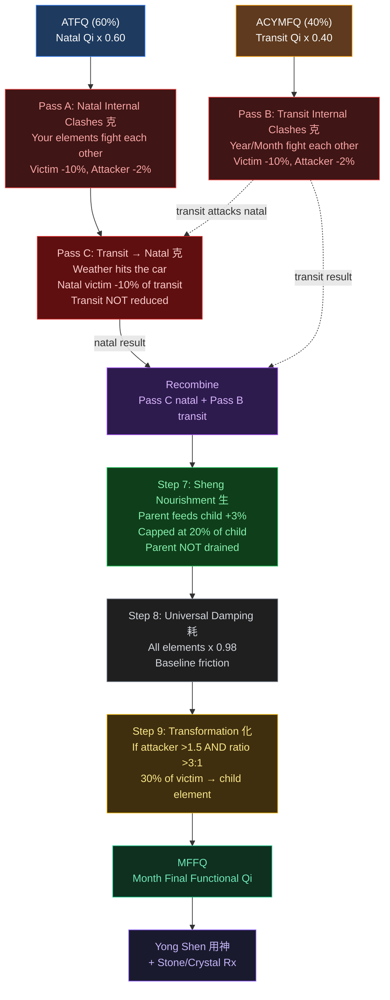
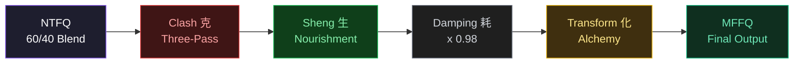
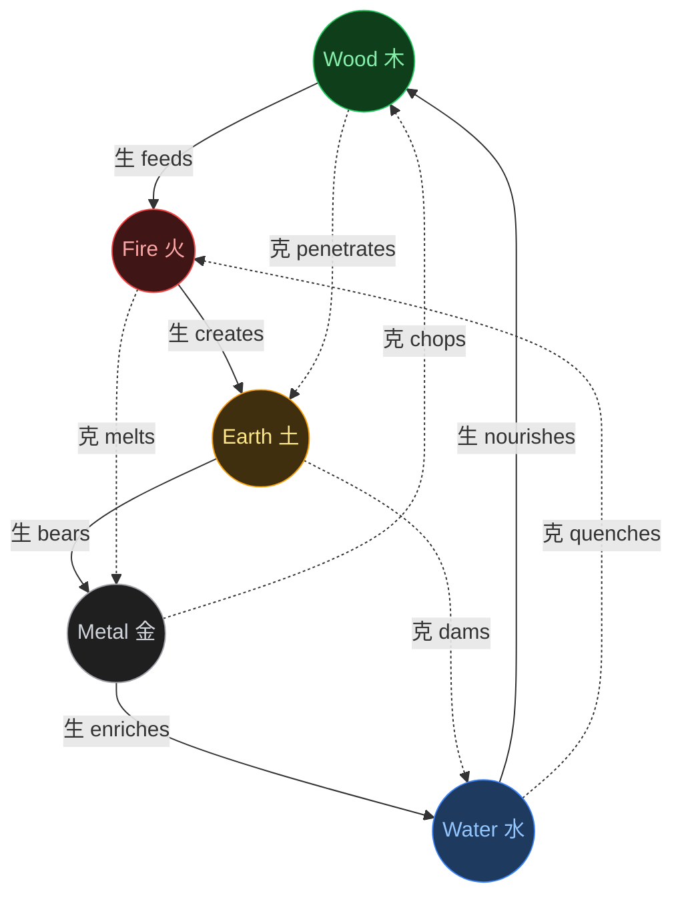

# Qi Adjustment Pipeline — Mermaid Diagram

Paste this into any Mermaid-compatible renderer (GitHub, Notion, Mermaid Live Editor, etc.)

## Full Three-Pass Pipeline

## Simplified Linear Version

## Five Element Cycles

